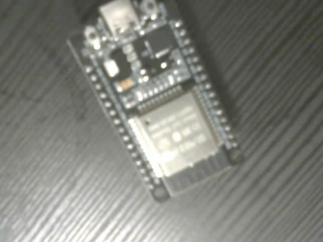

# ComponentBox

**An ESP32-CAM powered electronic component recognition and inventory platform.**

ComponentBox helps electronics students, makers, and lab teams turn loose component bins into a searchable inventory. An ESP32-CAM or dashboard upload captures a component image, a FastAPI backend runs a MobileNetV2-style classifier, and the dashboard lets a human review the result, correct labels, and grow the training dataset over time.



## Supported Components

The current classifier workflow supports one component per image across five classes:

- resistor
- capacitor
- jumper wire
- stepper motor
- 7-segment display

Low-confidence or unsupported images are returned as `unknown` so they can be reviewed instead of silently entering inventory with a bad label.

## Why It Exists

Small electronics collections become hard to manage quickly: parts get mixed, labels disappear, and project teams lose time checking whether a component is available. ComponentBox is a practical prototype for scanning parts at the bench, keeping recent captures visible, and building a better dataset from real corrections.

## Key Features

- ESP32-CAM firmware with local `/capture` preview and `/scan` upload actions.
- FastAPI image-upload API with rate limiting and scan history.
- Training-ready MobileNetV2 transfer-learning classifier.
- Dashboard upload flow for camera or local images.
- Latest-scan polling and scan detail review.
- Human correction loop that can save reviewed images back into `dataset/<class>/`.
- Lightweight inventory action for detected or corrected scans.
- Mock uploader for testing without hardware.
- Pytest coverage for backend behavior, rate limiting, and resistor utility logic.

## Architecture

```text
ESP32-CAM or dashboard upload
        |
        v
FastAPI /api/component-scans
        |
        v
ComponentImageClassifier
MobileNetV2-style Keras model, confidence threshold, unknown fallback
        |
        v
Scan store + dashboard polling
        |
        v
Human correction -> dataset/<class>/ -> retraining
        |
        v
Inventory
```

The ESP32-CAM captures JPEG images and posts them to the backend. The backend owns validation, rate limiting, image storage, classification, correction, and inventory actions. The dashboard remains a browser-based review surface and preserves the existing scan-card workflow.

## Tech Stack

- **Firmware:** ESP32-CAM, Arduino C++, `WiFi`, `WebServer`, `HTTPClient`
- **Backend:** Python, FastAPI, Pydantic, OpenCV, NumPy, pytest
- **ML:** TensorFlow/Keras, MobileNetV2 transfer learning
- **Dashboard:** AngularJS 1.8, vanilla CSS, static dev server
- **Testing:** pytest, FastAPI test client

## Repository Layout

```text
componentbox/
|-- assets/                  Project images and demo media
|-- backend/                 FastAPI app, services, scripts, tests
|-- dashboard/               AngularJS scan review dashboard
|-- dataset/                 Class folders for training images
|-- docs/                    Architecture, setup, API, classifier, testing docs
|-- firmware/esp32_cam_capture/
|   |-- esp32_cam_capture.ino
|   `-- secrets.example.h
|-- mock_device/             Local image uploader that simulates the ESP32-CAM
`-- sample_data/             Example data and report placeholders
```

## Setup

### 1. Backend

```powershell
cd backend
python -m venv .venv
.venv\Scripts\activate
pip install -r requirements.txt
uvicorn app.main:app --reload
```

The API defaults to `http://localhost:8000`.

Useful environment variables:

```powershell
set RESISTOR_IMAGE_RATE_LIMIT=12
set COMPONENT_CLASSIFIER_MODEL=models/component_classifier.keras
set COMPONENT_CLASSIFIER_CONFIDENCE=0.75
set COMPONENT_SCAN_IMAGE_DIR=data/scans
set COMPONENT_SCAN_METADATA=data/scans.json
set COMPONENT_DATASET_DIR=../dataset
```

### 2. Dashboard

```powershell
cd dashboard
npm install
npm start
```

Open `http://localhost:5173`.

The dashboard uses `http://localhost:8000` by default. To point it at another backend, set `window.COMPONENTBOX_API_URL` before `src/app.js` loads, or set `COMPONENTBOX_API_URL` in browser local storage.

### 3. ESP32-CAM Firmware

Copy the example secrets file and fill in local values:

```powershell
copy firmware\esp32_cam_capture\secrets.example.h firmware\esp32_cam_capture\secrets.h
```

Edit `secrets.h`:

```cpp
const char* WIFI_SSID = "YOUR_WIFI_SSID";
const char* WIFI_PASSWORD = "YOUR_WIFI_PASSWORD";
const char* COMPONENTBOX_BACKEND_SCAN_URL = "http://YOUR_BACKEND_HOST:8000/api/component-scans";
```

Then upload `firmware/esp32_cam_capture/esp32_cam_capture.ino` from the Arduino IDE using the AI Thinker ESP32-CAM board profile.

### 4. Mock Upload Without Hardware

```powershell
python mock_device/send_fake_component_image.py assets/sample_images/esp32.jpg
```

Use `--api-url` to target a non-local backend.

## Model Training

Collect images in class folders:

```text
dataset/
|-- resistor/
|-- capacitor/
|-- wire/
|-- stepper_motor/
`-- seven_segment/
```

Install training dependencies and train:

```powershell
cd backend
pip install -r requirements-training.txt
python scripts/train_component_classifier.py --dataset ../dataset --output models/component_classifier.keras
```

The training script uses MobileNetV2 transfer learning with a validation split. The repository should not claim a production accuracy number until it is measured on a held-out dataset captured with the same ESP32-CAM setup.

## Human Correction Loop

1. Capture or upload a component image.
2. Backend returns a recommended class, confidence, or `unknown`.
3. Dashboard displays the scan in the review queue.
4. A teammate confirms or corrects the label.
5. The backend can copy the saved image into the matching dataset folder.
6. Future model training uses the corrected examples.

This keeps the project honest: uncertain predictions become useful training data instead of hidden inventory mistakes.

## API Overview

- `GET /api/health` - health check.
- `POST /api/component-scans` - upload a component image.
- `POST /api/resistor-scans` - backwards-compatible alias for existing firmware/dashboard flows.
- `GET /api/component-scans/latest` - latest accepted scan for dashboard polling.
- `GET /api/resistor-scans/latest` - backwards-compatible latest-scan alias.
- `GET /api/component-scans` - recent scan history.
- `PATCH /api/component-scans/{scan_id}/correction` - confirm or correct a component label.
- `POST /api/inventory/components` - add a detected or corrected scan to inventory.
- `GET /api/inventory/components` - list lightweight inventory items.

See [docs/api.md](docs/api.md) for request and response examples.

## Testing

```powershell
cd backend
pytest
```

The public release keeps tests focused on backend contracts and deterministic helpers. Manual hardware validation is still required for camera focus, lighting, network setup, and real-world classification quality.

## Limitations

- The classifier expects one supported component per image.
- Results depend heavily on lighting, focus, background, and training data quality.
- The backend returns `unknown` when no trained model is available or confidence is below threshold.
- Inventory storage is intentionally lightweight for the current prototype.
- Resistor band calculation utilities are retained, but the main scan endpoint currently performs component classification rather than resistance decoding.

## Roadmap

- Expand and balance the ESP32-CAM dataset for all five classes.
- Add measured evaluation reports before publishing model-quality claims.
- Improve dashboard controls for dataset review batches.
- Add persistent inventory storage.
- Support model export for edge deployment experiments.
- Add object-detection support for images with multiple components.
- Add richer component attributes after class recognition.

## Contributors And Teamwork

ComponentBox is structured for collaboration: firmware, backend, ML, dashboard, and documentation can evolve independently while sharing one scan workflow. The dashboard work is preserved as the review surface for the project, and backend aliases keep existing ESP32-CAM integrations working while the naming moves from resistor-only scans to component scans.

## Security Notes

Local credentials belong in `firmware/esp32_cam_capture/secrets.h`, which is ignored by Git. Do not commit Wi-Fi names, Wi-Fi passwords, personal LAN addresses, API tokens, model checkpoints with private data, or runtime scan captures.
